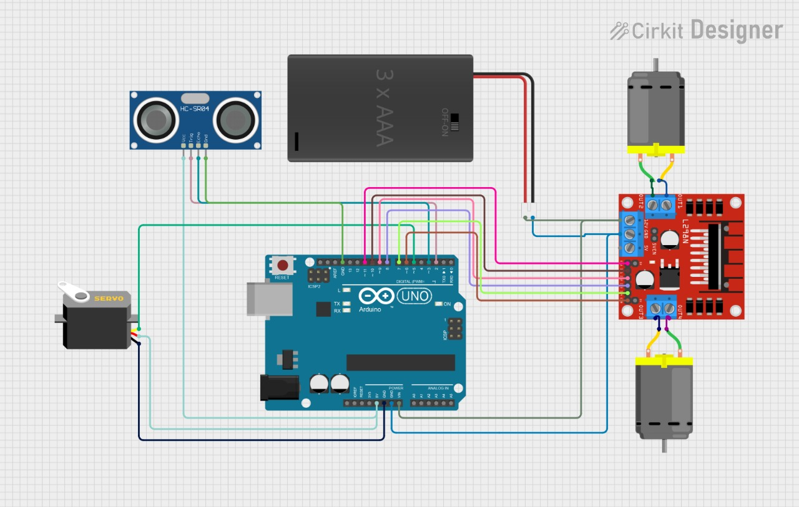
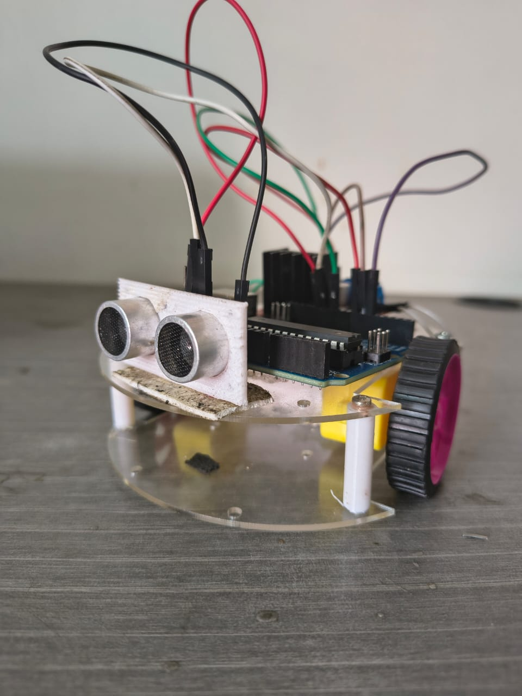

# 🚗 Obstacle-Avoiding Robot using Ultrasonic Sensor and L298N Motor Driver

This project showcases an autonomous **Obstacle-Avoiding Robot** using an Arduino, ultrasonic sensor, and L298N motor driver. The robot moves forward and automatically avoids obstacles by detecting distance using an ultrasonic sensor.

---

## 📁 Repository Contents

- 🗂️ [`obstacle_avoiding_robot.ino`](obstacle_avoiding_robot.ino) – Arduino sketch for obstacle avoidance logic.
- 🖼️ [`circuit_diagram.jpg`](circuit_diagram.jpg) – Circuit wiring diagram.
- 📸 [`demo.jpg`](demo.jpg) – Preview of the robot hardware.
- 🎞️ [`demo_video.mp4`](demo_video.mp4) – Demo video of the robot in action.

---

## 🖼️ Circuit Diagram



---

## 📸 Robot Preview



---

## 🎥 Demo Video

> 🔽 Click below to preview or download the demo video:

[▶️ Watch Demo Video](demo_video.mp4)

---

## 🔌 Components Required

- Arduino Uno  
- HC-SR04 Ultrasonic Sensor  
- L298N Motor Driver Module  
- 2 DC Motors and Wheels  
- Chassis, Battery Pack  
- Jumper Wires  
- USB Cable  

---

## ⚙️ How It Works

- The **ultrasonic sensor** measures the distance to obstacles ahead.
- If the path is **clear**, the robot moves forward.
- If an obstacle is detected within a threshold (e.g. 15 cm), the robot **stops and turns** to find a new direction.

---

## 🧾 Arduino Sketch Overview

```cpp
// Obstacle-Avoiding Robot with Ultrasonic Sensor and L298 Motor Driver

const int trigPin = 11;
const int echoPin = 10;

// Add motor control pins and logic below...
